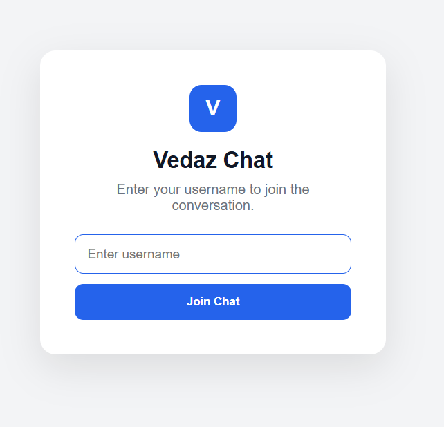
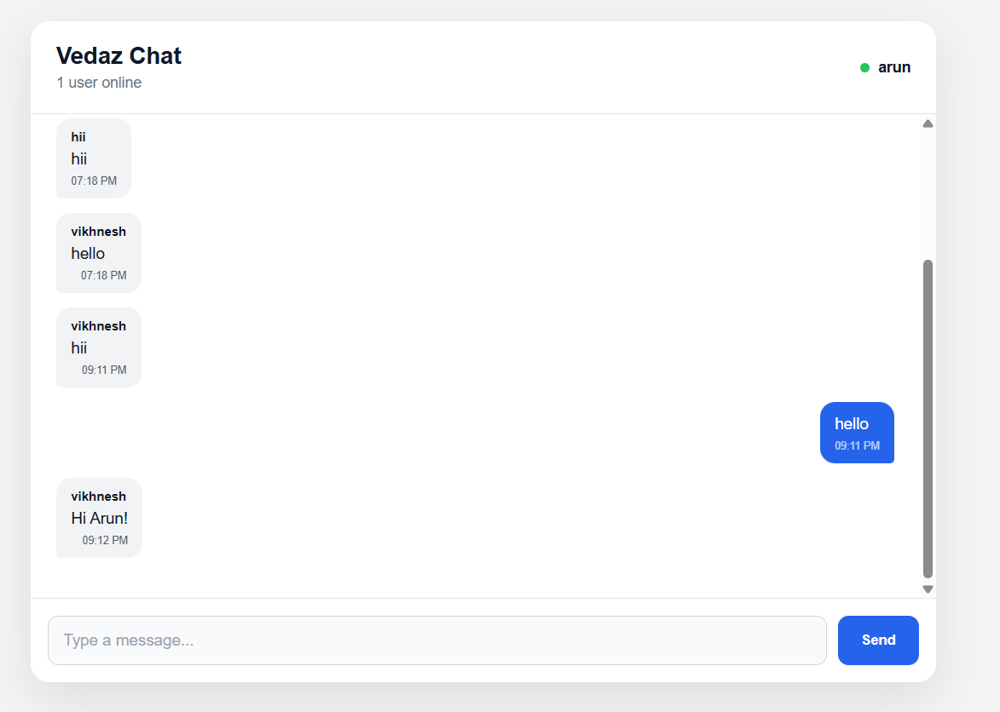

# 💬 Vedaz Chat

A real-time chat application built with **React, Node.js, Express, MongoDB, Socket.IO, and Multer**.

Vedaz Chat provides real-time messaging with persistent chat history, online user tracking, typing indicators, message search, dark mode, message deletion, and file/image sharing.

---

## 🚀 Features

* 💬 **Real-Time Messaging** — Messages are delivered instantly using Socket.IO
* 💾 **MongoDB Persistence** — Messages are stored in MongoDB
* 👤 **Username-Based Login** — Simple username-based chat entry
* 🟢 **Online Users** — Displays the number of currently connected users
* ✍️ **Typing Indicator** — Shows when another user is typing
* 🕒 **Message Timestamps** — Displays the time each message was sent
* 🔍 **Message Search** — Search messages by username or message content
* 🗑️ **Message Deletion** — Users can delete their own messages
* 📎 **File Attachments** — Supports file uploads
* 🖼️ **Image Sharing** — Supports sharing image files
* 📄 **Document Sharing** — Supports supported document and text files
* 🌙 **Dark Mode** — Light and dark theme support
* 💾 **Persistent Chat History** — Previous messages remain available after refreshing
* 📱 **Responsive UI** — Works across desktop, tablet, and mobile devices
* 🔌 **Connection Handling** — Handles Socket.IO connection and disconnection events

---

## 🛠️ Tech Stack

### Frontend

* React.js
* Vite
* JavaScript
* HTML5
* CSS3
* Socket.IO Client
* Axios

### Backend

* Node.js
* Express.js
* Socket.IO
* Multer
* CORS
* dotenv

### Database

* MongoDB
* Mongoose

---

## 🏗️ Application Architecture

```text
                    ┌─────────────────────┐
                    │     React Client    │
                    │                     │
                    │   Chat Components   │
                    │   Socket.IO Client  │
                    │   REST API Client   │
                    └──────────┬──────────┘
                               │
                 ┌─────────────┴─────────────┐
                 │                           │
          REST API Requests          Socket.IO Events
                 │                           │
                 ▼                           ▼
        ┌─────────────────────────────────────────┐
        │          Node.js + Express              │
        │                                         │
        │       REST API + Socket.IO Server       │
        │              + Multer                   │
        └──────────────────┬──────────────────────┘
                           │
                 ┌─────────┴─────────┐
                 │                   │
                 ▼                   ▼
          ┌─────────────┐     ┌──────────────┐
          │   MongoDB   │     │    Uploads   │
          │             │     │              │
          │ Chat History│     │ Images/Files │
          └─────────────┘     └──────────────┘
```

---

## 📂 Project Structure

```text
vedaz-chat/
│
├── backend/
│   ├── config/
│   │   └── db.js
│   │
│   ├── controllers/
│   │   └── messageController.js
│   │
│   ├── middleware/
│   │   └── uploadMiddleware.js
│   │
│   ├── models/
│   │   └── Message.js
│   │
│   ├── routes/
│   │   └── messageRoutes.js
│   │
│   ├── sockets/
│   │   └── chatSocket.js
│   │
│   ├── uploads/
│   │   └── .gitkeep
│   │
│   ├── .env.example
│   ├── package.json
│   └── server.js
│
├── frontend/
│   ├── src/
│   │   ├── components/
│   │   │   ├── ChatHeader.jsx
│   │   │   ├── MessageBubble.jsx
│   │   │   ├── MessageInput.jsx
│   │   │   └── MessageList.jsx
│   │   │
│   │   ├── services/
│   │   │   └── chatService.js
│   │   │
│   │   ├── App.jsx
│   │   ├── App.css
│   │   └── main.jsx
│   │
│   ├── package.json
│   └── vite.config.js
│
├── .gitignore
└── README.md
```

---

## ⚙️ How It Works

### 1. Username Login

Users enter a username to join the chat.

```text
Username
   ↓
Join Chat
   ↓
Socket.IO Connection
   ↓
Chat Interface
```

No authentication system is currently required.

---

### 2. Real-Time Messaging

When a user sends a message:

```text
User
  │
  ▼
React Chat Interface
  │
  ▼
Socket.IO
  │
  ▼
Node.js Server
  │
  ├──────────────► MongoDB
  │
  └──────────────► Connected Users
```

The message is stored in MongoDB and broadcast to connected clients in real time.

---

### 3. Message Persistence

Messages are stored in MongoDB.

```text
Send Message
     ↓
Save to MongoDB
     ↓
Refresh Browser
     ↓
Fetch Message History
     ↓
Previous Messages Available
```

The application loads the latest stored messages when the chat is opened.

---

### 4. Online Users

When a user joins:

```text
User joins
    ↓
Socket connection established
    ↓
user_online event
    ↓
Server tracks connected user
    ↓
online_users event
    ↓
All clients receive updated count
```

When the user disconnects, the server removes them from the online user list.

---

### 5. Typing Indicator

When a user starts typing:

```text
User types
    ↓
typing event
    ↓
Socket.IO Server
    ↓
Other users receive
user_typing
```

When the user stops typing, a `user_stop_typing` event is emitted.

---

### 6. File and Image Sharing

Files can be selected using the attachment button.

```text
Select File
     ↓
Frontend File Input
     ↓
Upload API
     ↓
Multer
     ↓
backend/uploads/
     ↓
File URL
     ↓
Socket.IO Message
     ↓
Other Users
```

Uploaded files are excluded from Git using `.gitignore`.

---

### 7. Message Deletion

Users can delete their own messages.

```text
Delete Message
      ↓
Socket.IO
      ↓
Server verifies username
      ↓
MongoDB message deleted
      ↓
message_deleted event
      ↓
All connected clients update
```

A user cannot delete another user's message.

---

### 8. Message Search

Users can search existing messages by:

* Message content
* Username

The search is performed on the messages already loaded into the frontend.

---

### 9. Dark Mode

The application supports light and dark themes.

The selected theme is stored in browser `localStorage`, allowing the preference to remain after refreshing the page.

---

## 🔌 API Endpoints

### Get Messages

```http
GET /api/messages
```

Returns the latest stored chat messages.

### Send Message

```http
POST /api/messages
```

Example:

```json
{
  "username": "Vikhnesh",
  "message": "Hello!"
}
```

### Upload File

```http
POST /api/messages/upload
```

Uses `multipart/form-data`.

Form field:

```text
file
```

---

## 🔄 Socket.IO Events

### Client → Server

```text
user_online
typing
stop_typing
send_message
delete_message
```

### Server → Client

```text
online_users
user_typing
user_stop_typing
new_message
message_deleted
message_error
```

---

## 📎 File Upload

Multer is used to handle file uploads.

Uploaded files are stored locally in:

```text
backend/uploads/
```

The upload directory is excluded from Git so that uploaded files are not committed to the repository.

The application can handle supported image and file types within the configured upload size limit.

---

## 🔐 Environment Variables

Create:

```text
backend/.env
```

Example:

```env
PORT=5000
CLIENT_URL=http://localhost:5173
MONGODB_URI=your_mongodb_connection_string
```

For security:

> Never commit the real `.env` file to GitHub.

A `.env.example` file is included to show the required environment variables.

---

## 🔧 Installation

### Prerequisites

Make sure you have installed:

* Node.js
* npm
* MongoDB

### Clone Repository

```bash
git clone https://github.com/your-username/vedaz-chat.git
cd vedaz-chat
```

---

## 📦 Backend Setup

```bash
cd backend
npm install
```

Create your `.env` file:

```env
PORT=5000
CLIENT_URL=http://localhost:5173
MONGODB_URI=your_mongodb_connection_string
```

Start the backend:

```bash
npm run dev
```

Backend:

```text
http://localhost:5000
```

---

## 💻 Frontend Setup

Open another terminal:

```bash
cd frontend
npm install
```

Start the frontend:

```bash
npm run dev
```

Frontend:

```text
http://localhost:5173
```

---

## 🧪 Testing

To test the real-time functionality:

1. Start the backend.
2. Start the frontend.
3. Open the application in two browser windows.
4. Join with different usernames.
5. Send messages between users.
6. Verify real-time delivery.
7. Test the typing indicator.
8. Test online user count.
9. Search messages.
10. Delete your own message.
11. Toggle dark mode.
12. Share an image or supported file.
13. Refresh the browser and verify message history.

---

## 📱 Responsive Design

Vedaz Chat supports:

```text
Desktop 💻
     ↓
Tablet
     ↓
Mobile 📱
```

The chat layout automatically adapts to smaller screen sizes.

---

## 🎯 Project Objectives

This project demonstrates practical implementation of:

* Real-time web communication
* Socket.IO
* REST API development
* MongoDB data persistence
* Mongoose
* React component architecture
* Client-server communication
* File uploads using Multer
* Connection state management
* Search functionality
* Dark mode
* Responsive UI development

---

## 🔮 Future Improvements

Possible future enhancements:

* 👥 Multiple chat rooms
* 🔐 User authentication
* 👤 User profiles
* 🔒 Private messaging
* ✓ Message read receipts
* ✏️ Message editing
* 😀 Message reactions
* ☁️ Cloud file storage
* 🖼️ Better image previews
* 🚀 Production deployment
* 🔔 Push notifications

---

## 📸 Screenshots

Add screenshots of the application here:

```text
screenshots/
├── login.png
├── chat.png
├── dark-mode.png
├── file-sharing.png
└── mobile-chat.png
```

Example:

```markdown





```

---

## 👨‍💻 Author

**Vikhnesh Sathyan**

MCA Graduate | Full Stack Developer

---

## 📄 License

This project was developed for learning and development purposes.
